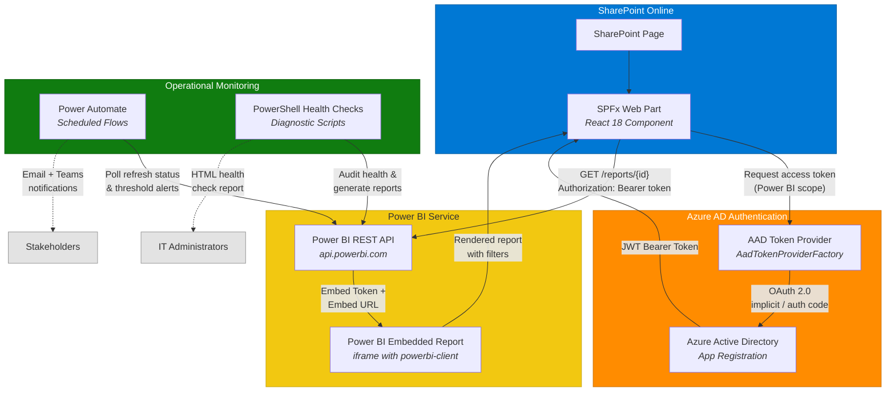
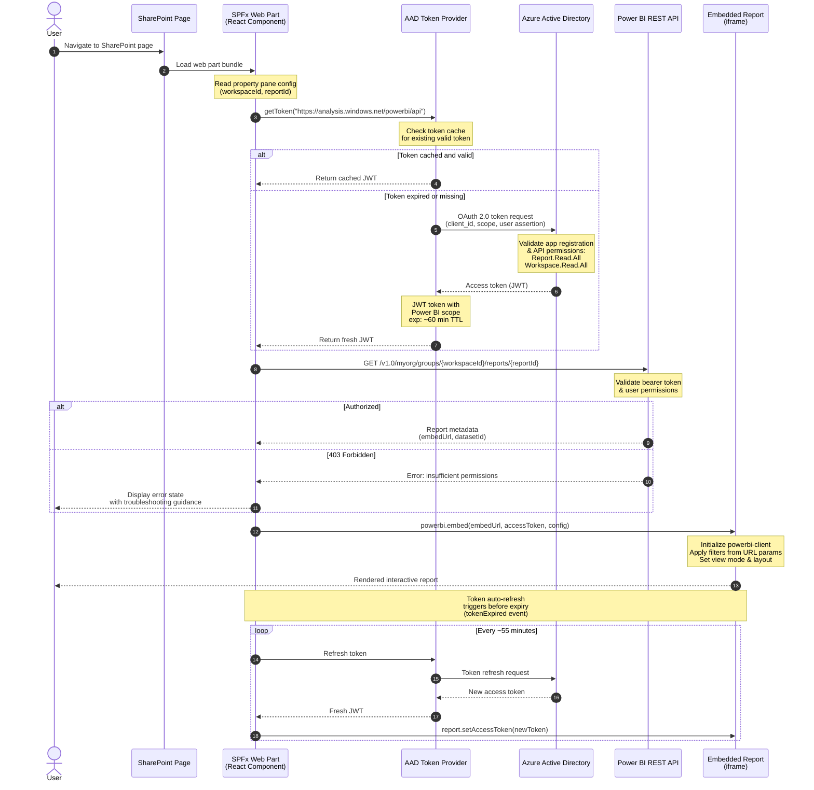

# SharePoint Power BI Dashboard


A production-ready SharePoint Framework (SPFx) web part that embeds Power BI reports with dynamic filtering, paired with PowerShell health-check scripts and Power Automate alert flows for end-to-end operational monitoring.

> **[View the interactive dashboard mockup](docs/screenshots/hero-dashboard.html)** -- open in your browser to see the full dark-theme SharePoint experience with animated KPI cards, trend charts, heat maps, and incident tables.

---

## Overview

This project solves three common challenges in enterprise Power BI + SharePoint deployments:

1. **Embedding** -- A fully configured SPFx web part that securely embeds Power BI reports in SharePoint Online and Microsoft Teams, with AAD token acquisition, URL-based dynamic filtering, and a responsive layout.
2. **Monitoring** -- PowerShell scripts that audit dataset refreshes, gateway health, workspace permissions, and embed configuration, generating a consolidated HTML report.
3. **Alerting** -- Power Automate flow definitions that poll for refresh failures and data-threshold breaches, then notify stakeholders via email and Teams.

## Architecture

```
+---------------------+       +-----------------------+       +------------------+
|  SharePoint Online  |       |   Power BI Service    |       |  Power Automate  |
|  (SPFx Web Part)    |<----->|   Reports & Datasets  |<----->|  Alert Flows     |
+---------------------+       +-----------------------+       +------------------+
        |                               |
        | PowerBIService               | REST API
        | (singleton + token cache)     |
        v                               v
+---------------------+       +-----------------------+
|  Azure AD           |       |  PowerShell Health    |
|  App Registration   |       |  Check Scripts        |
+---------------------+       +-----------------------+
```

The SPFx web part uses a **singleton service layer** (`PowerBIService`) that manages AAD token caching with proactive refresh, exponential-backoff retry, and a typed event emitter for connection state changes. See [ADR 003](docs/adr/003-token-caching-strategy.md) for the token caching rationale.



## How It Works

When a user navigates to a SharePoint page containing the Power BI Dashboard web part, the following token acquisition and embed flow takes place:



---

## Features

### SPFx Web Part
- Secure AAD-based token acquisition (user-owns-data pattern)
- Property pane for workspace ID, report ID, and display options
- Dynamic filtering via URL query parameters (`?pbi_Table_Column=value`)
- **Filter Panel** -- reusable filter panel with basic (dropdown), advanced (conditions), and date range (calendar) filters; persists state to URL query parameters
- **Connection Status Indicator** -- real-time connection state (Connecting/Connected/Disconnected/Reconnecting) with exponential-backoff auto-reconnect, token expiry countdown, and manual refresh
- Responsive layout with loading states and error handling
- Support for SharePoint pages, Teams personal apps, and Teams tabs

### Health Check Scripts
- **Refresh Status** -- audit dataset refresh history with pass/fail summary
- **Gateway Health** -- enumerate gateways and test every data-source connection
- **Permissions Audit** -- workspace access list, dataset permissions, and RLS roles
- **Embed Config Validation** -- GUID checks, token acquisition, API permission tests
- **Dataset Size** -- compare dataset sizes against Pro (1 GB) and Premium (10 GB) limits with configurable warning thresholds
- **Usage Metrics** -- report view counts, unique viewers, dataset refresh durations, success rates, and workspace storage utilization with Table/CSV/JSON output
- **Master Runner** -- orchestrates all checks and produces a colour-coded HTML report

### Power Automate Flows
- Hourly polling for dataset refresh failures with email + Teams alerts
- Configurable DAX-based data threshold alerts
- Weekly scheduled report export to PDF with email distribution
- Ready-to-import JSON definitions with documented parameters

---

## Prerequisites

| Requirement | Version / Details |
|---|---|
| Node.js | 18.x (LTS) |
| npm | 9+ |
| Gulp CLI | `npm i -g gulp-cli` |
| SPFx Yeoman Generator | 1.22+ (for scaffolding only) |
| SharePoint Online | Tenant with App Catalog |
| Power BI | Pro or Premium Per User licence |
| Azure AD | App registration with Power BI API permissions |
| PowerShell | 5.1+ or PowerShell 7+ |
| MicrosoftPowerBIMgmt | `Install-Module MicrosoftPowerBIMgmt` |
| Power Automate | Premium licence (for HTTP connector) |

---

## Quick Start

```bash
# Clone the repository
git clone https://github.com/your-org/sharepoint-powerbi-dashboard.git
cd sharepoint-powerbi-dashboard/spfx-webpart

# Install dependencies
npm install

# Serve locally (opens the SharePoint Workbench)
gulp serve

# Build and package for production
gulp bundle --ship
gulp package-solution --ship
```

The `.sppkg` package is generated in `spfx-webpart/sharepoint/solution/`. Upload it to your tenant App Catalog and approve the Power BI API permission request in the SharePoint Admin Center.

---

## Web Part Configuration

1. Add the **Power BI Dashboard** web part to a SharePoint page.
2. Open the property pane and enter:
   - **Workspace ID** -- the Power BI workspace GUID (find it in the workspace URL).
   - **Report ID** -- the Power BI report GUID (find it in the report URL).
3. Toggle **Show Filter Pane** and **Show Page Navigation** as needed.
4. Save and publish the page.

### Dynamic Filtering via URL

Append query parameters in the format `pbi_TableName_ColumnName=value` to the page URL to apply filters at load time:

```
https://contoso.sharepoint.com/sites/analytics/SitePages/Sales.aspx?pbi_Sales_Region=West&pbi_Sales_Year=2026
```

Multiple values for the same filter are comma-separated: `pbi_Sales_Region=West,East`.

### Screenshots

Open the following HTML files in your browser to see interactive mockups of the web part:

- **[Hero Dashboard](docs/screenshots/hero-dashboard.html)** -- Full dark-theme SharePoint page with animated KPI cards, SVG trend chart with gradient fill, donut chart, service health heat map, incident table, and glassmorphism filter panel
- **[Dashboard Embedded View](docs/screenshots/dashboard-embedded.html)** -- Power BI report embedded in a SharePoint page with KPI cards, bar chart, donut chart, incident table, and filter pane
- **[Property Pane Configuration](docs/screenshots/property-pane.html)** -- SPFx property pane showing Report ID, Workspace ID, toggle switches, and connection status
- **[Error and Loading States](docs/screenshots/error-state.html)** -- Loading spinner, authentication error, and "no report configured" states side by side

---

## Health Checks

All scripts are in the `health-checks/` directory.

### Run All Checks

```powershell
.\Invoke-PowerBIHealthCheck.ps1 `
    -WorkspaceId "00000000-0000-0000-0000-000000000000" `
    -DatasetId   "11111111-1111-1111-1111-111111111111" `
    -ClientId    "22222222-2222-2222-2222-222222222222" `
    -TenantId    "contoso.onmicrosoft.com" `
    -ReportId    "33333333-3333-3333-3333-333333333333"
```

An HTML report is saved to `health-checks/reports/`. Open **[Health Report Preview](docs/screenshots/health-report.html)** in your browser to see a sample report.

### Individual Scripts

| Script | Purpose |
|---|---|
| `Test-PowerBIRefreshStatus.ps1` | Check dataset refresh history for failures |
| `Test-PowerBIGatewayHealth.ps1` | Verify gateway and data-source connectivity |
| `Test-PowerBIPermissions.ps1` | Audit workspace members, dataset permissions, RLS |
| `Test-PowerBIEmbedConfig.ps1` | Validate embed configuration and token generation |
| `Test-PowerBIDatasetSize.ps1` | Check dataset sizes against Pro and Premium limits |
| `Get-PowerBIUsageMetrics.ps1` | Report views, unique viewers, refresh durations, storage utilization |

Each script supports `-Help` via standard PowerShell `Get-Help`.

---

## Power Automate Flows

Pre-built flow definitions are in `power-automate-flows/`. See the [flow README](power-automate-flows/README.md) for import instructions and required connections.

| Flow | Trigger | Action |
|---|---|---|
| `refresh-failure-alert.json` | Every 1 hour | Email + Teams alert on refresh failure |
| `data-threshold-alert.json` | Every 30 minutes | Email + Teams alert when DAX value exceeds threshold |
| `scheduled-report-email.json` | Weekly (Monday 8 AM) | Export report page as PDF and email to distribution list |

---

## Diagrams

Detailed Mermaid diagrams are available in the `docs/diagrams/` directory. These render automatically on GitHub and in any Mermaid-compatible Markdown viewer.

| Diagram | Description |
|---|---|
| [System Architecture](docs/diagrams/architecture.md) | High-level component map showing SharePoint, Azure AD, Power BI, and monitoring layers |
| [Token Acquisition & Embed Flow](docs/diagrams/token-flow.md) | Sequence diagram of the full OAuth token flow from page load to rendered report |
| [Health Check Pipeline](docs/diagrams/health-check-flow.md) | Flowchart of the master health-check runner with parallel script execution |
| [Error Recovery Decision Tree](docs/diagrams/error-recovery.md) | Step-by-step troubleshooting flowchart with concrete actions at every leaf node |
| [Deployment Pipeline](docs/diagrams/deployment-pipeline.md) | End-to-end deployment stages from local dev to production monitoring |

---

## Architecture Decision Records

Key design decisions are documented as lightweight ADRs in `docs/adr/`:

| ADR | Title | Status |
|---|---|---|
| [001](docs/adr/001-spfx-over-iframe.md) | Use SPFx Web Part over direct iframe embedding | Accepted |
| [002](docs/adr/002-health-check-architecture.md) | PowerShell-based health check pipeline | Accepted |
| [003](docs/adr/003-token-caching-strategy.md) | Client-side AAD token caching with refresh | Accepted |

Each ADR follows the [Context / Decision / Consequences](https://adr.github.io/) format and includes trade-off analysis with mitigations.

---

## Advanced Patterns

The SPFx web part implements several enterprise TypeScript patterns:

### Service Layer (`services/PowerBIService.ts`)
- **Singleton** with `getInstance()` / `resetInstance()` lifecycle
- **AAD token caching** with 55-minute proactive refresh (tokens expire at 60 min)
- **Generic retry with exponential backoff** -- `retryAsync<T>()` function with configurable jitter, max delay, and per-error retry predicates
- **Typed event emitter** for `connectionStateChange`, `tokenRefresh`, and `embedError` events
- **Configuration builder** -- fluent `EmbedConfigBuilder` for constructing embed configs with compile-time safety
- **Proper disposal** -- clears timers, nullifies state, prevents memory leaks

### Type System (`models/types.ts`)
- **Branded types** -- `ReportId`, `WorkspaceId`, `DatasetId` prevent accidental ID misuse at compile time
- **Discriminated unions** -- `ReportState` (Loading | Ready | Error | Refreshing) with `kind` tag for exhaustive narrowing
- **Custom error hierarchy** -- `PowerBIAuthError`, `PowerBIEmbedError`, `PowerBIConfigError` extending a base `PowerBIError`
- **Type guards** -- `isReportReady()`, `isPowerBIError()`, etc.
- **Utility types** -- `DeepPartial<T>`, `Mutable<T>`, `DeepMutable<T>`, `RequireAtLeastOne<T>`

---

## Code Quality

### Error Boundary (`components/ErrorBoundary.tsx`)
- React class-component error boundary that catches render failures
- Professional error UI with Fluent-style card layout
- Retry button resets the error state and re-renders children
- After 3 failed retries, shows "contact support" guidance with diagnostic context
- Logs structured error data (message, stack, component stack, timestamp) to the console

### Configuration Validator (`utils/ConfigValidator.ts`)
- Validates Report ID, Workspace ID, and embed URL format before any API calls
- Returns a typed `ValidationResult` with field-level error messages
- Detects common mistakes (workspace name pasted instead of GUID, HTTP instead of HTTPS, refresh interval too low)
- `errorsByField()` helper for inline property pane validation

### Retry Logic
- Generic `retryAsync<T>()` with exponential backoff + jitter
- Per-error retry predicates (auth errors are not retried; transient network errors are)
- Configurable max attempts, base delay, and ceiling

---

## Troubleshooting Playbook

For a comprehensive guide with 13 common issues, step-by-step resolutions, and prevention strategies, see the **[Troubleshooting Playbook](docs/troubleshooting-playbook.md)**. Each issue links to the relevant health check script.

> For an interactive decision tree, see the **[Error Recovery Diagram](docs/diagrams/error-recovery.md)**.

### Quick Reference

| Symptom | Likely Cause | Fix |
|---|---|---|
| Web part shows "Failed to acquire token" | API permission not approved | Approve in SharePoint Admin > API access |
| Report loads but is blank | Wrong report ID or workspace ID | Verify GUIDs in property pane |
| 403 Forbidden on embed | User lacks Power BI Pro licence | Assign Pro or PPU licence |
| Filters not applying | Incorrect URL parameter format | Use `pbi_Table_Column=value` pattern |
| Gateway data source shows FAIL | Credentials expired or server offline | Update credentials in Power BI > Manage gateways |
| Refresh failures overnight | Source system maintenance window | Reschedule refresh or add retry |
| Embed token generation fails | App lacks workspace Member role | Add service principal as Member/Contributor |

---

## Project Structure

```
sharepoint-powerbi-dashboard/
  spfx-webpart/
    config/                        # SPFx build configuration
    src/webparts/powerBiDashboard/
      components/
        IPowerBiDashboardProps.ts  # Props and state interfaces
        PowerBiDashboard.tsx       # Main React component
        PowerBiDashboard.module.scss
        FilterPanel.tsx            # Reusable filter panel (basic/advanced/date range)
        FilterPanel.module.scss
        ConnectionStatus.tsx       # Connection status indicator with auto-reconnect
        ConnectionStatus.module.scss
        ErrorBoundary.tsx          # React error boundary with retry + support escalation
      models/
        types.ts                   # Branded types, discriminated unions, type guards
      services/
        PowerBIService.ts          # Singleton service: token cache, retry, events
      utils/
        ConfigValidator.ts         # Web part config validation with field-level errors
      PowerBiDashboardWebPart.ts   # SPFx web part entry point
      PowerBiDashboardWebPart.manifest.json
    package.json
    tsconfig.json
    gulpfile.js
  health-checks/
    Invoke-PowerBIHealthCheck.ps1  # Master runner
    Test-PowerBIRefreshStatus.ps1
    Test-PowerBIGatewayHealth.ps1
    Test-PowerBIPermissions.ps1
    Test-PowerBIEmbedConfig.ps1
    Test-PowerBIDatasetSize.ps1    # Dataset size vs Pro/Premium limits
    Get-PowerBIUsageMetrics.ps1    # Usage analytics (views, refreshes, storage)
    reports/                       # Generated HTML reports (git-ignored)
  power-automate-flows/
    refresh-failure-alert.json
    data-threshold-alert.json
    scheduled-report-email.json    # Weekly PDF report export + email
    README.md
  docs/
    adr/
      001-spfx-over-iframe.md      # ADR: SPFx vs iframe embedding
      002-health-check-architecture.md  # ADR: PowerShell health check pipeline
      003-token-caching-strategy.md     # ADR: Client-side token caching
    troubleshooting-playbook.md    # 13-issue troubleshooting guide
    diagrams/
      architecture.md              # System architecture (Mermaid)
      token-flow.md                # Token acquisition sequence diagram
      health-check-flow.md         # Health check pipeline flowchart
      error-recovery.md            # Error recovery decision tree
      deployment-pipeline.md       # Deployment stages flowchart
    screenshots/
      hero-dashboard.html          # Dark-theme hero dashboard with animations
      dashboard-embedded.html      # Embedded report mockup
      health-report.html           # Health check report mockup
      property-pane.html           # Property pane configuration mockup
      error-state.html             # Loading, error, and no-data states
  .gitignore
  README.md
```

---

## Contributing

See **[CONTRIBUTING.md](CONTRIBUTING.md)** for prerequisites, setup instructions, development workflow, and code style guidelines.

---

## Changelog

### v1.3.0

- Added `PowerBIService.ts` singleton service layer with AAD token caching (55-min proactive refresh), generic `retryAsync<T>` with exponential backoff, typed event emitter, and fluent `EmbedConfigBuilder`
- Added `types.ts` comprehensive type system with branded types (`ReportId`, `WorkspaceId`, `DatasetId`), discriminated union `ReportState`, custom error hierarchy (`PowerBIAuthError`, `PowerBIEmbedError`, `PowerBIConfigError`), type guards, and utility types (`DeepPartial<T>`, `Mutable<T>`, `RequireAtLeastOne<T>`)
- Added `ErrorBoundary.tsx` React error boundary with professional error UI, retry logic (up to 3 attempts), and "contact support" escalation
- Added `ConfigValidator.ts` web part configuration validator with GUID format checks, embed URL validation, and field-level error messages
- Added Architecture Decision Records: [ADR 001](docs/adr/001-spfx-over-iframe.md) (SPFx vs iframe), [ADR 002](docs/adr/002-health-check-architecture.md) (health check pipeline), [ADR 003](docs/adr/003-token-caching-strategy.md) (token caching strategy)
- Added `hero-dashboard.html` dark-theme interactive mockup with animated KPI cards, SVG trend chart, donut chart, heat map, incident table, and glassmorphism filter panel
- Updated architecture diagram to reflect service layer; added ADR, Advanced Patterns, and Code Quality sections to README

### v1.2.0

- Added `FilterPanel.tsx` reusable filter panel component with basic dropdown, advanced condition, and date range filter types; persists filter state to URL query parameters
- Added `ConnectionStatus.tsx` connection status indicator with real-time state display (Connecting/Connected/Disconnected/Reconnecting), exponential-backoff auto-reconnect, token expiry countdown with 5-minute warning, and manual refresh
- Added `Get-PowerBIUsageMetrics.ps1` usage analytics script for report view counts, unique viewers, dataset refresh durations and success rates, workspace storage utilization; supports Table/CSV/JSON output formats

### v1.1.0

- Added `Test-PowerBIDatasetSize.ps1` health check for monitoring dataset sizes against Pro and Premium limits
- Added `scheduled-report-email.json` Power Automate flow for weekly PDF report distribution
- Added comprehensive [Troubleshooting Playbook](docs/troubleshooting-playbook.md) with 13 documented issues
- Updated health check script table and flow reference

### v1.0.0

- SPFx web part with AAD token acquisition, dynamic URL filtering, and responsive layout
- Health check scripts: refresh status, gateway health, permissions audit, embed config validation
- Power Automate flows: refresh failure alert, data threshold alert
- Architecture diagrams and HTML screenshot mockups
- Deployment documentation and project scaffolding

---

## Roadmap

Planned features for future releases:

- **Workspace dashboard web part** -- embed multiple reports in a tabbed layout with workspace-level navigation
- **Automated report snapshots** -- scheduled capture of report visuals to a SharePoint image library for historical comparison
- **Power BI REST API proxy** -- Azure Function middleware for server-side token management (app-owns-data pattern)
- **Multi-language support** -- localized property pane labels and error messages for global deployments
- **Capacity monitoring** -- health check scripts for Premium capacity metrics (CPU, memory, query duration)

---

## License

This project is licensed under the [MIT License](LICENSE).
