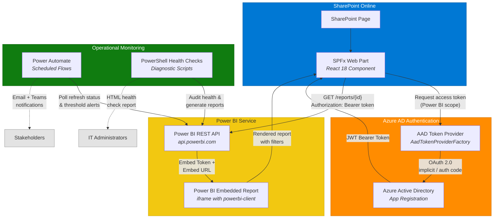

# System Architecture

```mermaid
graph TD
    subgraph SharePoint["SharePoint Online"]
        SP[SharePoint Page]
        WP[SPFx Web Part<br/><i>React 18 Component</i>]
        SP --> WP
    end

    subgraph Authentication["Azure AD Authentication"]
        AAD[AAD Token Provider<br/><i>AadTokenProviderFactory</i>]
        AZURE_AD[Azure Active Directory<br/><i>App Registration</i>]
        AAD -->|"OAuth 2.0<br/>implicit / auth code"| AZURE_AD
    end

    subgraph PowerBI["Power BI Service"]
        API[Power BI REST API<br/><i>api.powerbi.com</i>]
        EMBED[Power BI Embedded Report<br/><i>iframe with powerbi-client</i>]
        API -->|"Embed Token +<br/>Embed URL"| EMBED
    end

    subgraph Monitoring["Operational Monitoring"]
        PA[Power Automate<br/><i>Scheduled Flows</i>]
        PS[PowerShell Health Checks<br/><i>Diagnostic Scripts</i>]
    end

    WP -->|"Request access token<br/>(Power BI scope)"| AAD
    AZURE_AD -->|"JWT Bearer Token"| WP
    WP -->|"GET /reports/{id}<br/>Authorization: Bearer token"| API
    EMBED -->|"Rendered report<br/>with filters"| WP

    PA -->|"Poll refresh status<br/>& threshold alerts"| API
    PS -->|"Audit health &<br/>generate reports"| API

    PA -.->|"Email + Teams<br/>notifications"| STAKEHOLDERS[Stakeholders]
    PS -.->|"HTML health<br/>check report"| ADMIN[IT Administrators]

    style SharePoint fill:#0078d4,stroke:#005a9e,color:#fff
    style Authentication fill:#ff8c00,stroke:#cc7000,color:#fff
    style PowerBI fill:#f2c811,stroke:#c9a60e,color:#333
    style Monitoring fill:#107c10,stroke:#0b5e0b,color:#fff
    style STAKEHOLDERS fill:#e3e3e3,stroke:#999,color:#333
    style ADMIN fill:#e3e3e3,stroke:#999,color:#333
```
