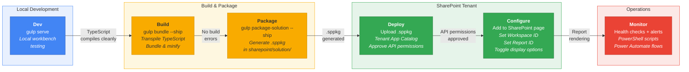

# Deployment Pipeline

```mermaid
flowchart LR
    DEV["<b>Dev</b><br/>gulp serve<br/><i>Local workbench<br/>testing</i>"]
    BUILD["<b>Build</b><br/>gulp bundle --ship<br/><i>Transpile TypeScript<br/>Bundle & minify</i>"]
    PACKAGE["<b>Package</b><br/>gulp package-solution --ship<br/><i>Generate .sppkg<br/>in sharepoint/solution/</i>"]
    DEPLOY["<b>Deploy</b><br/>Upload .sppkg<br/><i>Tenant App Catalog<br/>Approve API permissions</i>"]
    CONFIGURE["<b>Configure</b><br/>Add to SharePoint page<br/><i>Set Workspace ID<br/>Set Report ID<br/>Toggle display options</i>"]
    MONITOR["<b>Monitor</b><br/>Health checks + alerts<br/><i>PowerShell scripts<br/>Power Automate flows</i>"]

    DEV -->|"TypeScript<br/>compiles cleanly"| BUILD
    BUILD -->|"No build<br/>errors"| PACKAGE
    PACKAGE -->|".sppkg<br/>generated"| DEPLOY
    DEPLOY -->|"API permissions<br/>approved"| CONFIGURE
    CONFIGURE -->|"Report<br/>rendering"| MONITOR

    subgraph Local["Local Development"]
        DEV
    end
    subgraph CI["Build & Package"]
        BUILD
        PACKAGE
    end
    subgraph Tenant["SharePoint Tenant"]
        DEPLOY
        CONFIGURE
    end
    subgraph Ops["Operations"]
        MONITOR
    end

    style Local fill:#e8f0fe,stroke:#4285f4,color:#333
    style CI fill:#fef7e0,stroke:#f9ab00,color:#333
    style Tenant fill:#e6f4ea,stroke:#34a853,color:#333
    style Ops fill:#fce8e6,stroke:#ea4335,color:#333

    style DEV fill:#4285f4,stroke:#2d5fba,color:#fff
    style BUILD fill:#f9ab00,stroke:#c98a00,color:#333
    style PACKAGE fill:#f9ab00,stroke:#c98a00,color:#333
    style DEPLOY fill:#34a853,stroke:#267a3c,color:#fff
    style CONFIGURE fill:#34a853,stroke:#267a3c,color:#fff
    style MONITOR fill:#ea4335,stroke:#b8342a,color:#fff
```
