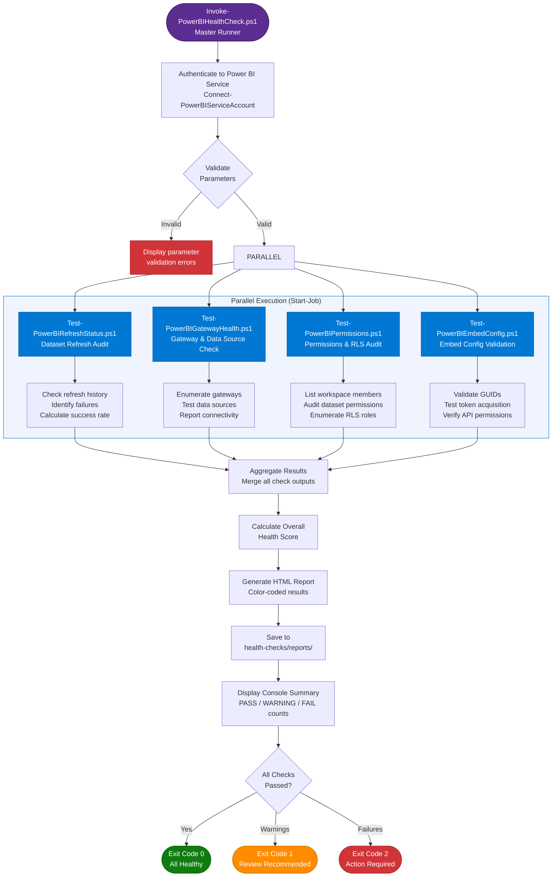

# Health Check Pipeline

```mermaid
flowchart TD
    START([Invoke-PowerBIHealthCheck.ps1<br/>Master Runner]) --> AUTH[Authenticate to Power BI Service<br/>Connect-PowerBIServiceAccount]
    AUTH --> VALIDATE{Validate<br/>Parameters}

    VALIDATE -->|Invalid| ERROR[Display parameter<br/>validation errors]
    VALIDATE -->|Valid| PARALLEL

    PARALLEL --> REFRESH[Test-PowerBIRefreshStatus.ps1<br/>Dataset Refresh Audit]
    PARALLEL --> GATEWAY[Test-PowerBIGatewayHealth.ps1<br/>Gateway & Data Source Check]
    PARALLEL --> PERMS[Test-PowerBIPermissions.ps1<br/>Permissions & RLS Audit]
    PARALLEL --> EMBED[Test-PowerBIEmbedConfig.ps1<br/>Embed Config Validation]

    subgraph Parallel["Parallel Execution (Start-Job)"]
        REFRESH --> R_RESULT["Check refresh history<br/>Identify failures<br/>Calculate success rate"]
        GATEWAY --> G_RESULT["Enumerate gateways<br/>Test data sources<br/>Report connectivity"]
        PERMS --> P_RESULT["List workspace members<br/>Audit dataset permissions<br/>Enumerate RLS roles"]
        EMBED --> E_RESULT["Validate GUIDs<br/>Test token acquisition<br/>Verify API permissions"]
    end

    R_RESULT --> AGGREGATE
    G_RESULT --> AGGREGATE
    P_RESULT --> AGGREGATE
    E_RESULT --> AGGREGATE

    AGGREGATE[Aggregate Results<br/>Merge all check outputs] --> SCORE[Calculate Overall<br/>Health Score]

    SCORE --> REPORT[Generate HTML Report<br/>Color-coded results]
    REPORT --> SAVE[Save to<br/>health-checks/reports/]

    SAVE --> SUMMARY[Display Console Summary<br/>PASS / WARNING / FAIL counts]

    SUMMARY --> EXIT_CODE{All Checks<br/>Passed?}
    EXIT_CODE -->|Yes| SUCCESS([Exit Code 0<br/>All Healthy])
    EXIT_CODE -->|Warnings| WARN([Exit Code 1<br/>Review Recommended])
    EXIT_CODE -->|Failures| FAIL([Exit Code 2<br/>Action Required])

    style START fill:#5c2d91,stroke:#3b1d61,color:#fff
    style Parallel fill:#f0f4ff,stroke:#0078d4,color:#333
    style REFRESH fill:#0078d4,stroke:#005a9e,color:#fff
    style GATEWAY fill:#0078d4,stroke:#005a9e,color:#fff
    style PERMS fill:#0078d4,stroke:#005a9e,color:#fff
    style EMBED fill:#0078d4,stroke:#005a9e,color:#fff
    style SUCCESS fill:#107c10,stroke:#0b5e0b,color:#fff
    style WARN fill:#ff8c00,stroke:#cc7000,color:#fff
    style FAIL fill:#d13438,stroke:#a4262c,color:#fff
    style ERROR fill:#d13438,stroke:#a4262c,color:#fff
```
