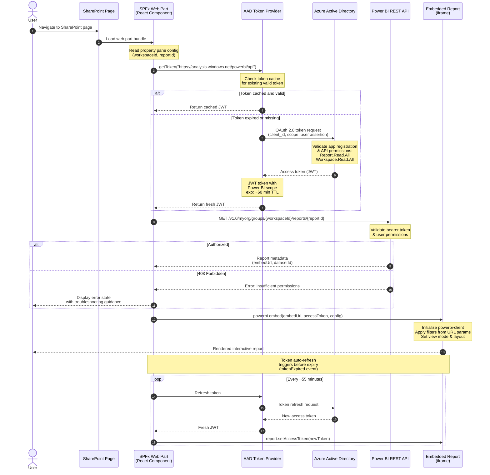

# Token Acquisition & Embed Flow

```mermaid
sequenceDiagram
    autonumber
    actor User
    participant SP as SharePoint Page
    participant WP as SPFx Web Part<br/>(React Component)
    participant AAD as AAD Token Provider
    participant Azure as Azure Active Directory
    participant API as Power BI REST API
    participant Report as Embedded Report<br/>(iframe)

    User->>SP: Navigate to SharePoint page
    SP->>WP: Load web part bundle

    Note over WP: Read property pane config<br/>(workspaceId, reportId)

    WP->>AAD: getToken("https://analysis.windows.net/powerbi/api")

    Note over AAD: Check token cache<br/>for existing valid token

    alt Token cached and valid
        AAD-->>WP: Return cached JWT
    else Token expired or missing
        AAD->>Azure: OAuth 2.0 token request<br/>(client_id, scope, user assertion)
        Note over Azure: Validate app registration<br/>& API permissions:<br/>Report.Read.All<br/>Workspace.Read.All
        Azure-->>AAD: Access token (JWT)
        Note over AAD: JWT token with<br/>Power BI scope<br/>exp: ~60 min TTL
        AAD-->>WP: Return fresh JWT
    end

    WP->>API: GET /v1.0/myorg/groups/{workspaceId}/reports/{reportId}
    Note over API: Validate bearer token<br/>& user permissions

    alt Authorized
        API-->>WP: Report metadata<br/>(embedUrl, datasetId)
    else 403 Forbidden
        API-->>WP: Error: insufficient permissions
        WP-->>User: Display error state<br/>with troubleshooting guidance
    end

    WP->>Report: powerbi.embed(embedUrl, accessToken, config)
    Note over Report: Initialize powerbi-client<br/>Apply filters from URL params<br/>Set view mode & layout

    Report-->>User: Rendered interactive report

    Note over WP,Report: Token auto-refresh<br/>triggers before expiry<br/>(tokenExpired event)

    loop Every ~55 minutes
        WP->>AAD: Refresh token
        AAD->>Azure: Token refresh request
        Azure-->>AAD: New access token
        AAD-->>WP: Fresh JWT
        WP->>Report: report.setAccessToken(newToken)
    end
```
